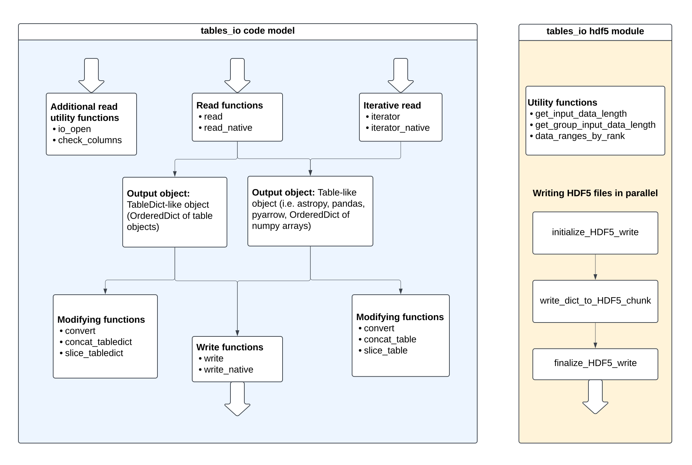

# Style Guide

## Documentation

All documentation is created using [Sphinx](https://www.sphinx-doc.org/en/master/index.html). The source files live in the `docs/` folder, and the output is created in the `_readthedocs/` folder in the main package. Documentation files are written in Markdown, and any images or other assets are in the `assets/` folder. When new documentation packages are added, make sure to add them to the [`requirements.txt`](https://github.com/LSSTDESC/tables_io/blob/main/docs/requirements.txt) file, where they will be used when [Read the Docs](https://about.readthedocs.com/) builds the documentation.

### Writing Documentation Pages

When writing new documentation pages, make sure to add them to the relevant `toctree` in [`index.rst`](https://github.com/LSSTDESC/tables_io/blob/main/docs/index.rst).

Tutorial Jupyter notebooks can be placed directly in the `notebooks/` directory, and they will be automatically evaluated and turned into a webpage via the [myst-nb](https://myst-nb.readthedocs.io/en/v0.13.2/index.html) extension.

### Building the Documentation Locally

To build the documentation locally, for instance, for preview or to manually upload to a specified location, run the following from the `docs/` directory with the appropriate conda environment activated:

```bash

# Remove any previous compiled documentation
make clean

# Make the HTML Documentation
make html

```

The HTML rendered documentation will live in the `_readthedocs/html` directory.

## Understanding the code

`tables_io` is organized such that the main functionalities are made available in the main `__init__.py`, and additionally HDF5 functionalities are made available in the `hdf5` module. The diagram below displays the main functions available and some of the most relevant HDF5 functions. For all of the available HDF5 functions, see the function overview of the <project:functionoverview.md#hdf5-module>.



The code itself is split into three main components: `io_utils`, `convert`, and `utils`. `io_utils` contains all of the read and write functions. `convert` contains all conversion functions, and `utils` contains all functions related to `slice` and `concat` functionality, as well as code array utilities. [`types.py`](https://github.com/LSSTDESC/tables_io/blob/main/src/tables_io/types.py) contains all the dictionaries relating table types and formats, as well as the functions that get information about what type a file or object falls into. [`lazy_modules.py`](https://github.com/LSSTDESC/tables_io/blob/main/src/tables_io/lazy_modules.py) handles loading in the necessary packages. See the diagram below to get a sense of the layout of the package.

```bash
tables_io
├── __init__.py
├── _version.py
├── cli.py
├── conv #conversion functions
│   ├── __init__.py
│   ├── conv_table.py
│   └── conv_tabledict.py
├── hdf5 #loads functions for chunked reads and writes of HDF5 files
│   ├── __init__.py
├── io_utils #io functions
│   ├── __init__.py
│   ├── iterator.py # functions related to chunked read
│   ├── read.py # functions to read in data from files
│   └── write.py # functions to write files
├── lazy_modules.py #handles loading of modules not required by installation
├── table_dict.py #deprecated
├── types.py #table types and format dictionaries and functions
└── utils/ # utility functions
├── ├── __init__.py
├── ├── array_utils.py # functions for handling array operations
├── ├── concat_utils.py # functions for concatenating tables and tabledicts
└── └── slice_utils.py # functions for slicing tables and tabledicts
```

Generally, the code files are formatted such that there are interface functions at the top of a given file. These interface functions then identify the input object types and call more specific functions, which are found further down in the file.

## Expectations

Generally, the code should follow the guidelines given in the [LSST DM Developer Guide](https://developer.lsst.io/index.html). This section lays out some project-specific guidelines.

When creating new test files, they should be in the same location within the `tests/` folder as the file that is being tested. The test file should have the name `test_[filename].py`, where `filename` is the name of the file being tested. For example, a test for the `src/tables_io/conv/conv_table.py` module is called `test_conv_table.py` and located in the `tests/conv/` folder.

### Naming conventions

- Single table objects (i.e. a `pandasDataFrame`, `numpyDict` of arrays) are referred to as `Table-like`.
- Objects that are `OrderedDict` objects of `Table-like` objects are referred to as `TableDict-like` objects
- Function names should be in snake case (like_this)
- Class names should use pascal case (LikeThis)

### Typing Recommendations:

It is recommended to use type hints for the arguments and outputs of functions to improve the ability to develop and understand code. For some tips on how to get started see this [cheat sheet](https://mypy.readthedocs.io/en/stable/cheat_sheet_py3.html).

Some tips for this project:

- When referring to a generic `TableDict` or `TableDict-like` object, use the `Mapping` type hint.
- Currently there is no good way to type hint `Table-like` objects other than the `numpyDict` object.

## Contribution workflow

The contribution workflow described here is pulled from the [RAIL contribution workflow](https://rail-hub.readthedocs.io/en/latest/source/contributing.html).

### Issue

When you identify something that should be done, [make an issue](https://github.com/LSSTDESC/tables_io/issues/new/choose) for it.

### Branch

Install the code following the [developer installation](devinstall.md#developer-environment-setup) instructions.
If your branch is addressing a specific issue, the branch name should be `issue/[issue_number]/[title]`, where the `[title]` is a short description of the issue, with `_` separating words.

While developing in a branch, don’t forget to pull from main regularly (at least daily) to make sure your work is compatible with other recent changes.

Make sure that if the issue solves one of the items listed in <project:devtechdebt.md>, you remove that item from the documentation page.

When you’re ready to merge your branch into the main branch, create a pull request (“PR”) in `tables_io` repository. GitHub has instructions [here](https://docs.github.com/en/pull-requests/collaborating-with-pull-requests/proposing-changes-to-your-work-with-pull-requests/creating-a-pull-request).

Several continuous integration checks will be performed for new pull requests. If any of these automatic processes find issues with the code, you should address them in the branch before sending for review. These include tests (does the code function correctly), pylint (code style), and coverage (how much code is exercised in unit tests).

Once you are satisfied with your PR, request that other team members review and approve it. You could send the request to someone whom you’ve worked with on the topic, or one of the core maintainers of `tables_io`.

### Merge

Once the changes in your PR have been approved, these are your next steps:

- merge the change by selecting “Squash and merge” on the approved pull request
- enter `closes #[#]` in the comment field to close the resolved issue
- delete your branch using the button on the merged pull request.

### Reviewing a PR

To review a pull request, it’s a good idea to start by pulling the changes and running the tests locally (see <project:devinstall.md#running-tests> for instructions).

Check the code for complete and accurate docstrings, sufficient comments, and ensure any instances of `#pragma: no cover` (excluding the code from unit test coverage accounting) are extremely well-justified.

Feel free to mark the PR with “Request changes” for necessary changes. e.g. writing an exception for an edge case that will break the code, updating names to adhere to the naming conventions, etc.

It is also considered good practice to make suggestions for optional improvements, such as adding a one-line comment before a clever block of code or including a demonstration of new functionality in the example notebooks.

## Version Release and Deployment Procedures

### Publishing Package on PyPI

There is a Github Action that will publish the package to [PyPI](https://pypi.org/project/tables-io/) after a new release is created.

### Making the Documentation on "Read The Docs"

Read the Docs is linked to the [github repo](https://github.com/LSSTDESC/tables_io), and will rebuild the docs when there are any changes to `main`. If there are any issues with this process, contact the project maintainer, Eric Charles.

### Informing Developers of Downstream Packages

`tables_io` is a core package of the LSST DESC RAIL ecosystem. Consequently, the developers of the following packages should be informed about new versions:

- [`qp`](https://github.com/LSSTDESC/qp)
- [`rail_base`](https://github.com/LSSTDESC/rail_base)
- [`rail_pipelines`](https://github.com/LSSTDESC/rail_pipelines)
- [`rail_astro_tools`](https://github.com/LSSTDESC/rail_astro_tools)
- [`rail_bpz`](https://github.com/LSSTDESC/rail_bpz)
- [`rail_pzflow`](https://github.com/LSSTDESC/rail_pzflow)
