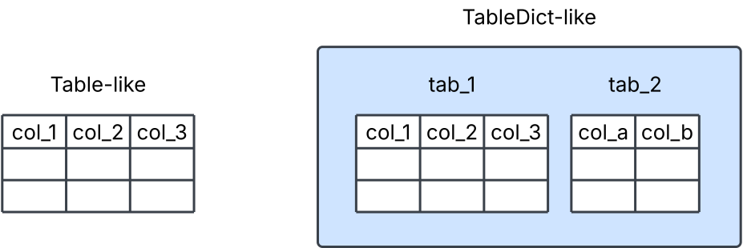

# Getting Started

## Installation

### Basic installation

To install basic `tables_io`, you can run the following command:

```bash
pip install tables_io
```

(parallel-installation)=

### Parallel installation

To install `tables_io` with parallel functionality, first make sure that your installations of h5py and HDF5 are built with MPI support. If you are running it in a conda environment, you can do this by running the following installation command:

```bash

conda install "h5py>=2.9=mpi_openmpi*"  # 2.9 is the first version built with mpi on this channel

```

If you run into errors with this, try adding the "conda-forge" channel:

```bash
conda install conda-forge::"h5py>=2.9=mpi_openmpi*"
```

This should install HDF5 and mpi4py as well. If not, you can install HDF5 via the following:

```bash
conda install "hdf5=*=*mpi_openmpi*"
```

You may also need to install [mpi4py](https://mpi4py.readthedocs.io/en/stable/install.html), which can be done through `pip`:

```bash
pip install mpi4py
```

or `conda`:

```bash
conda install mpi4py
```

Once you've installed the necessary dependencies, you can use the same installation command from above:

```bash
pip install tables_io
```

```{tip}
If you're having difficulties installing, try using the `environment.yml` file to set up your conda environment as described in <project:devinstall.md>, and then installing `tables_io` normally as described here.
```

### Installing from source

If you prefer to install from source, use the following commands:

```bash
# Clone the repository
git clone https://github.com/LSSTDESC/tables_io.git
cd tables_io

# Run the setup script
python setup.py install
```

## Main functionality

### Formats

The main functionality of `tables_io` is its ability to read and write tables of a variety of formats. `tables_io` deals with two types of objects in memory:

- a `Table-like` object: data with named columns, including `astropy` Tables, `numpy` recarrays, or `pandas` DataFrames (see <project:#supported-file-formats> for the full list of tabular formats).
- a `TableDict-like` object: an ordered dictionary of `Table-like` objects.



The main functions will take either of these objects as arguments, though some functions will only take one type of object. This is often specified in the function name itself.

The `Table-like` objects exist in memory as one of the multiple supported tabular formats. For example, they could be an `astropy` Table, or a dictionary of `numpy` arrays. `TableDict-like` objects also have a tabular format, which means that the `Table-like` objects they contain are all of that tabular format type. <project:#supported-tabular-formats> lists the available tabular formats.

### Read

A file can be read in using the {py:func}`read <tables_io.io_utils.read.read>` function. Here's an example of reading a table or tables from a `fits` file:

```{doctest}

>>> import tables_io
>>> tab = tables_io.read('filename.fits')

```

This reads the data to the default tabular format for the file type, which in this case is an `astropyTable`.

You can also specify a desired tabular format, in which case `read` will read the file to its native tabular format, then [`convert`](#tables_io.conv.conv_tabledict.convert) the `Table-like` or `TableDict-like` object to the desired format. You can see [an example here](cookbook.md#read-in-a-file-to-a-specific-format). <project:#supported-tabular-formats> lists the default tabular formats as they correspond to the file types.

```{note}
In order to receive a consistent output when reading in objects, you can use [`read_native`](#tables_io.io_utils.read.read_native), which will always read in a `TableDict-like` object. That object will also always have the default tabular format for that file type.
```

To read in a file a chunk of data at a time, you can use the [`iterator`](#tables_io.io_utils.iterator.iterator) function. This currently only works with a subset of the available file formats, which are listed in the function's documentation. You can [see an iteration example here](cookbook.md#iterating-through-data-in-an-hdf5-file).

### Conversion and other functionality

The `Table-like` and `TableDict-like` objects can also be converted to different tabular formats separately, using the [`convert`](#tables_io.conv.conv_tabledict.convert) function. For example:

```{doctest}

>>> import tables_io
>>> ap_tab = tables_io.convert(tab, 'pandasDataFrame')

```

Here we convert the `astropyTable` we converted earlier to a `pandasDataFrame`.

Additionally, `tables_io` functions exist to concatenate and to take a slice of objects. More details on these functions and some examples can be found in the Cookbook section on [basic table operations](cookbook.md#basic-table-operations).

### Write

The [`write`](#tables_io.io_utils.write.write) function will accept both `Table-like` and `TableDict-like` objects to write to a file.

```{doctest}

>>> import tables_io
>>> tables_io.write('filename.hdf5', tab)
'filename.hdf5'

```

Here, the type of file to write to is specified by the file name suffix, `hdf5`. If necessary, [`write` (docs)](#tables_io.io_utils.write.write) will convert the object to the related tabular type, then write to the specified file type. Otherwise, `tables_io` has a native file type for each of the tabular formats, which are listed in <project:#supported-tabular-formats>. You can write files to their native format by using [`write_native`](#tables_io.io_utils.write.write_native) directly.

(supported-file-formats)=

### Supported file formats

`tables_io` currently supports the following formats to read files in from and write to, with the associated suffixes:

| File format name | File suffix    | Produced by                                                                            |
| ---------------- | -------------- | -------------------------------------------------------------------------------------- |
| astropyFits      | 'fits'         | [`astropy.io.fits`](https://docs.astropy.org/en/stable/io/fits/index.html)             |
| astropyHDF5      | 'hf5'          | [`astropy`](https://docs.astropy.org/en/stable/io/unified.html#hdf5)                   |
| numpyHDF5        | 'hdf5'         | [`h5py`](https://docs.h5py.org/en/stable/quick.html#appendix-creating-a-file)          |
| numpyFits        | 'fit'          | [`astropy.io.fits`](https://docs.astropy.org/en/stable/io/fits/index.html)             |
| pyarrowHDF5      | 'hd5'          | [`pyarrow`](https://arrow.apache.org/docs/python/getstarted.html)                      |
| pandasHDF5       | 'h5'           | [`pandas`](https://pandas.pydata.org/pandas-docs/stable/user_guide/io.html#io-hdf5)    |
| pandaParquet     | 'parq' or 'pq' | [`pandas`](https://pandas.pydata.org/pandas-docs/stable/user_guide/10min.html#parquet) |
| pyarrowParquet   | 'parquet'      | [`pyarrow`](https://arrow.apache.org/docs/python/parquet.html)                         |

```{note}
`tables_io` does not require all of the above packages to function. If you do not have one of these packages installed, you will not be able to create tables of that type (i.e. if you do not have `pandas` installed, you cannot convert objects to `pandasDataFrame` or read in `pandasParquet` files.)
```

(tabular-formats)=

### Supported tabular formats

`tables_io` currently supports the following tabular formats in memory for `Table-like` or `TableDict-like` objects:

| Tabular format name | Actual format type                                                                                          |
| ------------------- | ----------------------------------------------------------------------------------------------------------- |
| astropyTable        | [`astropy.table.Table`](https://docs.astropy.org/en/stable/table/index.html)                                |
| numpyDict           | [`OrderedDict (str, np.array)`](https://docs.python.org/3/library/collections.html#collections.OrderedDict) |
| numpyRecarray       | [`np.recarray`](https://numpy.org/doc/stable/reference/generated/numpy.recarray.html)                       |
| pandasDataFrame     | [`pd.DataFrame`](https://pandas.pydata.org/pandas-docs/stable/reference/api/pandas.DataFrame.html)          |
| pyarrowTable        | [`pyarrow.Table`](https://arrow.apache.org/docs/python/generated/pyarrow.Table.html)                        |

The table below shows which tabular formats are available for `Table-like` or `TableDict-like` objects, and how they are associated with the available file types. File types in the 'File format for native read' column will be read in to the associated 'Tabular format in memory'. The default file that these tabular formats will be written to is given in the 'Native written file' column.

| Tabular format in memory | File format for native read                | Native written file |
| ------------------------ | ------------------------------------------ | ------------------- |
| astropyTable             | astropyHdf5, astropyFits                   | astropyHdf5         |
| numpyDict                | numpyHdf5                                  | numpyHdf5           |
| numpyRecarray            | astropyFits, numpyFits                     | numpyFits           |
| pandasDataFrame          | pandasParquet, pandasHdf5                  | pandasParquet       |
| pyarrowTable             | pyarrowParquet, pandasParquet, pyarrowHdf5 | pyarrowParquet      |
